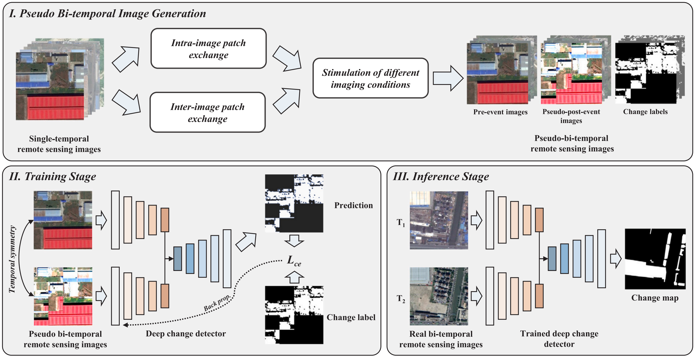

<h1 align="center">Exchange means change: an unsupervised single-temporal change detection framework based on intra- and inter-image patch exchange</h1>

<h3 align="center"> <a href="https://chrx97.com/">Hongruixuan Chen</a>, <a href="https://github.com/JTRNEO">Jian Song</a>, <a href="https://scholar.google.com/citations?user=DbTt_CcAAAAJ&hl=zh-CN">Chen Wu</a>, <a href="https://scholar.google.com/citations?user=Shy1gnMAAAAJ&hl=zh-CN">Bo Du</a>, and <a href="https://naotoyokoya.com/">Naoto Yokoya</a></h3>

This is an official implementation of I3PE framework in our ISPRS JP&RS 2023 paper: [Exchange means change: an unsupervised single-temporal change detection framework based on intra- and inter-image patch exchange](https://www.sciencedirect.com/science/article/abs/pii/S092427162300309X).
<div align="center">
  <br><br>
</div>

## Get started
### Requirements
Please download the following key python packages in advance.
```
python==3.6.15
pytorch==1.7.0
scikit-learn==0.22.1
scikit-image==0.17.2
imageio=2.15.0
numpy==1.19.5
tqdm==4.64.1
```

### Datasets
Two large-scale benchmark datasets, <a href="https://github.com/liumency/SYSU-CD">SYSU dataset</a> and <a href="https://captain-whu.github.io/SCD/
">SECOND dataset</a>, are used for experiments. Please download them and organize them in the following way. 

For the Wuhan dataset used in our paper, you can also download it here for your own research [<a href="https://drive.google.com/file/d/1f9tWouvzwjqf9oujg6BMh-xESzwEefO4/view?usp=drive_link">Google Drive</a>], [<a href="https://pan.baidu.com/s/1XLPPwfLl1HpSo0kzidIDpQ?pwd=8d27">Baidu Cloud</a>]. 
```
├── <THE-ROOT-PATH-OF-DATA>/
│   ├── SYSU/     
|   |   ├── train/
|   |   |   ├── T1/
|   |   |   ├── T2/
|   |   |   ├── GT/
|   |   ├── val/
|   |   |   |── ...
|   |   ├── test/
|   |   |   |── ...
|   |   
│   ├── SECOND/     
|   |   ├── train/
|   |   |   |── ...
|   |   ├── test/
|   |   |   |── ...
```

### Generate Single-Temporal Training Sets
Transfer the images in T1 and T2 under original training set to a new folder and rename the images.
```
python construct_single_temporal_set.py
```

Generate object maps and cluster maps for intra-image patch exchange method in advance.
```
python generate_object.py --dataset_path 'your own path here' --obj_num 1000
```
```
python generate_clustering_map.py --dataset_path 'your own path here' --eps 7 --min_samples 10
```

### Training Change Detectors
Training the deep change detector on the single-temporal training sets using both intra- and inter-image patch exchangem methods. 
```
python train_network_I3PE.py
```

Unsupervised change detection results of different methods on the test sets:

|               |       SYSU      |                      |       SECOND    |                      |                    
|:-------------:|:---------------:|:--------------------:|:---------------:|:--------------------:|
|     Method    |       OA        |          F1          |       OA        |          F1          |
|      <a href="https://github.com/ChenHongruixuan/ChangeDetectionRepository/tree/master/Methodology/Traditional/CVA">CVA      |      0.4539     |        0.3492        |      0.4332     |        0.3003        |  
|     <a href="https://github.com/ChenHongruixuan/ChangeDetectionRepository/tree/master/Methodology/Traditional/MAD">IRMAD     |      0.6914     |        0.3705        |      0.6829     |        0.3451        |  
|    <a href="https://github.com/ChenHongruixuan/ChangeDetectionRepository/tree/master/Methodology/Traditional/SFA"> ISFA      |      0.6977     |        0.3695        |      0.7130     |        0.3293        |  
|     OBCD      |      0.7091     |        0.4046        |      0.7005     |        0.3426        | 
|     <a href="https://ieeexplore.ieee.org/document/9669957">DCAE      |      0.7636     |        0.4390        |      0.7600     |        0.3340        |  
|     <a href="https://github.com/sudipansaha/dcvaVHROptical">DCVA |      0.6995     |        0.4450        |      0.6795     |        0.3681        | 
|     <a href="https://github.com/rulixiang/DSFANet">DSFA</a>       |      0.6326     |        0.4125        |      0.5961     |        0.3301        |  
|  <a href="https://github.com/ChenHongruixuan/KPCAMNet">KPCA-MNet</a>  |      0.7084     |        0.4482        |      0.6793     |        0.3670        | 
|     I3PE      |      0.7305     |        0.5547        |      0.7283     |        0.4380        |  

## Citation
If this code or dataset contributes to your research, please consider citing our paper:
```
@article{Chen2023Exchange,
    title = {Exchange means change: An unsupervised single-temporal change detection framework based on intra- and inter-image patch exchange},
    author = {Hongruixuan Chen and Jian Song and Chen Wu and Bo Du and Naoto Yokoya},
    journal = {ISPRS Journal of Photogrammetry and Remote Sensing},
    volume = {206},
    pages = {87-105},
    year = {2023},
    issn = {0924-2716},
    doi = {https://doi.org/10.1016/j.isprsjprs.2023.11.004}
}
```

## Q & A
**For any questions, please [contact us.](mailto:Qschrx@gmail.com)**