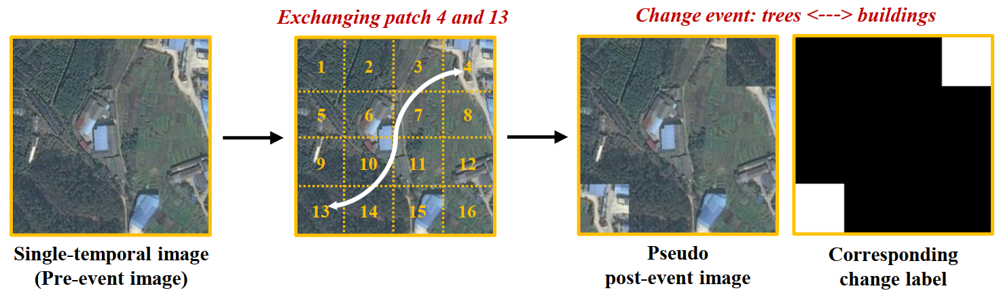
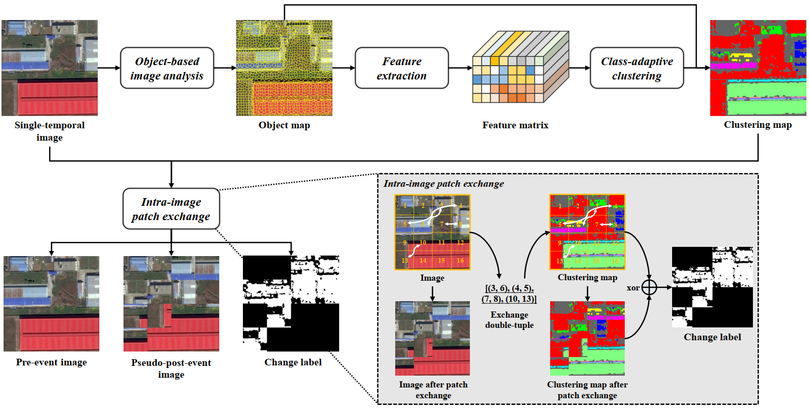
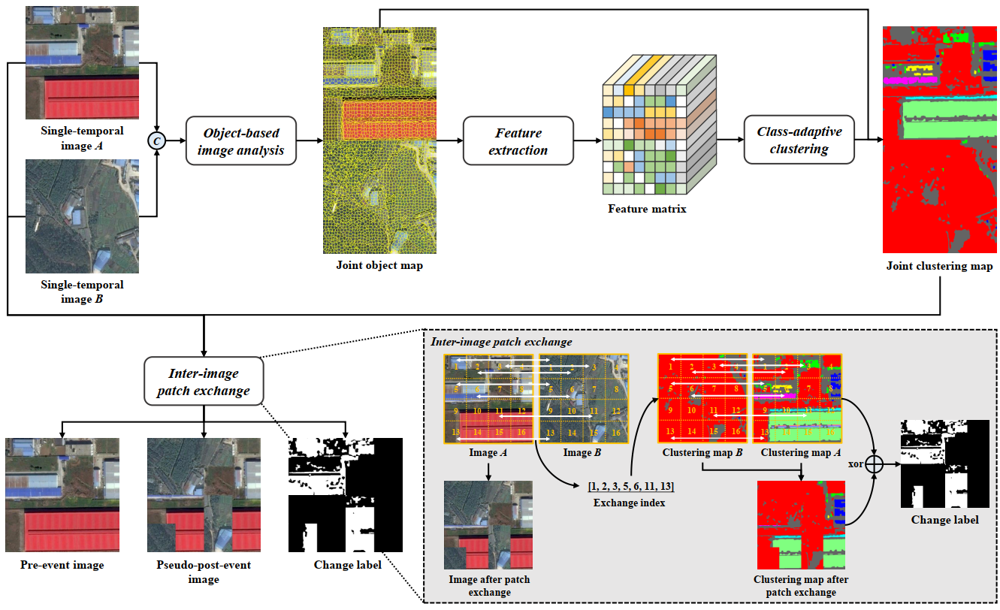

## Exchange means change: an unsupervised single-temporal change detection framework based on intra- and inter-image patch exchange

Code for I3PE paper: [Exchange means change: an unsupervised single-temporal change detection framework based on intra- and inter-image patch exchange.](https://arxiv.org/abs/2310.00689)

### Motivation
> We can generate land-cover change events by simply exchanging image patches.

### Two exchange mechanism
> Two exchange mechanisms are proposed based on the motivation. 

#### Intra-image patch exchange
> Generating land-cover change labels by exchanging image patches within the image

#### Inter-image patch exchange
> Generating land-cover change labels by exchanging image patches between images

